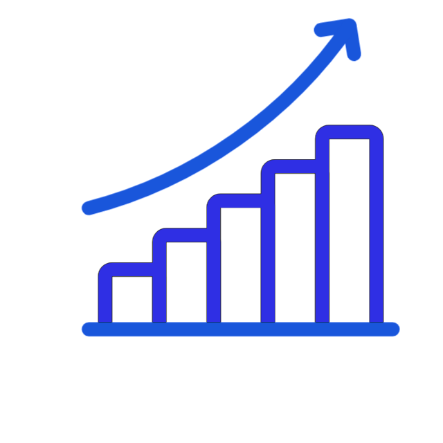

  

 

  

  
  
    
   <b>Indonesia</b>

---

##  About Me

I'm a **Fullstack Developer** focused on building secure, high-performance web applications — from fintech dashboards to decentralized protocols. My work lives at the intersection of **clean engineering**, **practical AI systems**, and **immersive 3D experiences**.

-  Cohort participant at **Dicoding ASAH 2025** — React & Back-End with AI
-  Exploring ML pipelines for real-world datasets (RFM segmentation, Fuzzy Inference Systems)
-  Personal site: **[yuriyadev.xyz](https://yuriyadev.xyz)**

---

##  Tech Stack

**Frontend**

**Backend**

**AI / ML**

**Web3 / Blockchain**

**Tools**

---

##  Featured Projects

<table>
  <tr>
    <td width="350" valign="top">
      <h3><a href="https://github.com/yuriya-dev/BlobCast">&nbsp;BlobCast</a></h3>
      
Decentralized social publishing protocol on the <strong>Sui blockchain</strong>. Uses Walrus for permanent content storage and Tatum enterprise RPC — a full Web3 social stack with Move smart contracts, Next.js frontend, and Express/Prisma backend.

      

        
        
        
      

      <a href="https://blob-cast.vercel.app/">&nbsp;Live&nbsp;Demo</a>&nbsp;·&nbsp;<a href="https://github.com/yuriya-dev/BlobCast">&nbsp;Code</a>
    </td>
    <td width="350" valign="top">
      <h3><a href="https://github.com/yuriya-dev/Agromonitor-Jateng">&nbsp;Agromonitor&nbsp;Jateng</a></h3>
      
Real-time agricultural commodity price monitoring and prediction dashboard for Central Java. Stock market-style UI with ML forecasting — built for practical use by regional stakeholders.

      

        
        
        
      

      <a href="https://github.com/yuriya-dev/Agromonitor-Jateng">&nbsp;Code</a>
    </td>
  </tr>
  <tr>
    <td width="350" valign="top">
      <h3><a href="https://github.com/yuriya-dev/SIPBANSOS">&nbsp;SIPBANSOS</a></h3>
      
Micro-ERP for local government — automates selection and ranking of social aid recipients using the <strong>SAW algorithm</strong>. Replaces manual, subjective processes with a transparent, data-driven system.

      

        
        
        
      

      <a href="https://github.com/yuriya-dev/SIPBANSOS">&nbsp;Code</a>
    </td>
    <td width="350" valign="top">
      <h3><a href="https://github.com/yuriya-dev/palm-tree-detection">&nbsp;Nyawit&nbsp;—&nbsp;Palm&nbsp;Detection</a></h3>
      
Fullstack UAV imagery platform that detects and classifies oil palm tree health in real time. Combines a React/Vite dashboard, Golang REST API, and a YOLO-seg ML inference pipeline.

      

        
        
        
      

      <a href="https://github.com/yuriya-dev/palm-tree-detection">&nbsp;Code</a>
    </td>
  </tr>
</table>

---

##  GitHub Stats

  
  

  

  

---

##  Let's Connect

  
  
  

---

  

